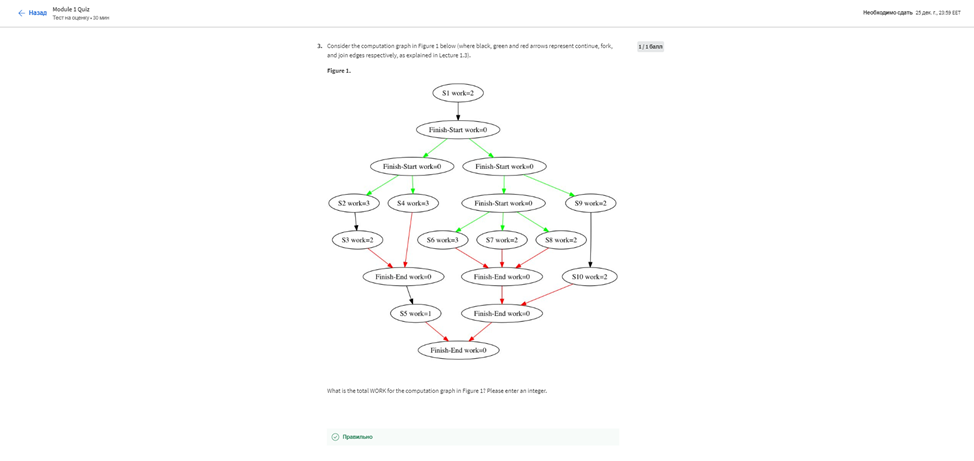
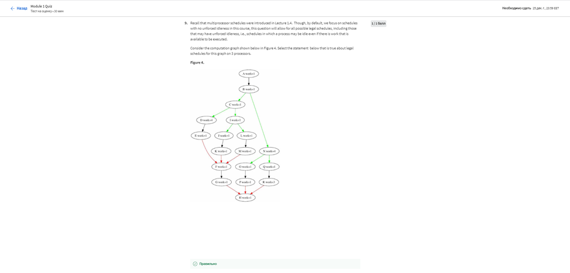

# МІНІСТЕРСТВО ОСВІТИ І НАУКИ УКРАЇНИ

### ХАРКІВСКИЙ НАЦІОНАЛЬНИЙ ЕКОНОМІЧНИЙ УНІВЕРСИТЕТ ІМЕНИ СЕМЕНА КУЗНЕЦЯ

### КАФЕДРА ІНФОРМАЦІЙНИХ СИСТЕМ

#### ЗВІТ

з проходження курсу «Parallel Programming in Java» 1-4 тиждень

з дисципліни «Сучасні Java-технології»

Виконав:
студент 4 курсу
групи  6.04.122.010.19.1
факультету ІТ
Маcлюк Світлана

Перевірив
доц. Поляков А.О.

Харків – 2022

#### Мета роботи
Дізнатися, основним концепціям паралельного програмування в контексті Java 8. Паралельне програмування дозволяє розробникам використовувати багатоядерні комп’ютери, щоб пришвидшити роботу їхніх додатків за рахунок одночасного використання кількох процесорів. Наприкінці цього курсу ви дізнаєтеся, як використовувати популярні паралельні фреймворки Java (такі як ForkJoin, Stream і Phaser) для написання паралельних програм для широкого діапазону багатоядерних платформ, включаючи сервери, настільні комп’ютери або мобільні пристрої, а також навчитеся про їх теоретичні основи, включаючи обчислювальні графи, ідеальний паралелізм, паралельне прискорення, закон Амдала, перегони даних і детермінізм.
#### Репозиторій
[Посилання на репозиторій](https://github.com/MaslyukSveta/MJT/tree/master/SpringEcosystemandCore)

#### Хід роботи

#### Хід роботи

> Тиждень 1

Було виконанно Module 1 Quiz:
>
>
>
>
>
>
>
>
>

Результат:
>

Було виконанно mini project1:
>

> Тиждень 2

Було виконанно Module 2 Quiz:
>
>
>
>
>
>

Результат:
>

Було виконанно mini project2:
>

> Тиждень 3

Було виконанно Module 3 Exam:
>
>
>
>
>
>
>
>
>
>

Результат:
>

Було виконанно mini project3:
>

Було виконанно Module 4 Exam:
>
>
>
>
>

Результат:
>

Було виконанно mini project4:
>

Сертефікат:
>
>

#### Висновок
На даному курсі ми дізнатися, основним концепціям паралельного програмування в контексті Java 8. Паралельне програмування дозволяє розробникам використовувати багатоядерні комп’ютери, щоб пришвидшити роботу їхніх додатків за рахунок одночасного використання кількох процесорів. Наприкінці цього курсу ви дізнаєтеся, як використовувати популярні паралельні фреймворки Java (такі як ForkJoin, Stream і Phaser) для написання паралельних програм для широкого діапазону багатоядерних платформ, включаючи сервери, настільні комп’ютери або мобільні пристрої, а також навчитеся про їх теоретичні основи, включаючи обчислювальні графи, ідеальний паралелізм, паралельне прискорення, закон Амдала, перегони даних і детермінізм.