# МІНІСТЕРСТВО ОСВІТИ І НАУКИ УКРАЇНИ

### ХАРКІВСКИЙ НАЦІОНАЛЬНИЙ ЕКОНОМІЧНИЙ УНІВЕРСИТЕТ ІМЕНИ СЕМЕНА КУЗНЕЦЯ

### КАФЕДРА ІНФОРМАЦІЙНИХ СИСТЕМ

#### ЗВІТ

з проходження курсу «Spring - Cloud Overview» 1-2 тиждень

з дисципліни «Сучасні Java-технології»

Виконав:
студент 4 курсу
групи  6.04.122.010.19.1
факультету ІТ
Маcлюк Світлана

Перевірив
доц. Поляков А.О.

Харків – 2022

#### Мета роботи
Дізнатися, чому Spring Framework є одним із домінуючих фреймворків розробки Java. 

#### Репозиторій
[Посилання на репозиторій](https://github.com/MaslyukSveta/MJT/tree/master/SpringCloudOverview)

#### Хід роботи

#### Хід роботи
>Тиждень 1

Було виконанно Module 1 Quiz:
>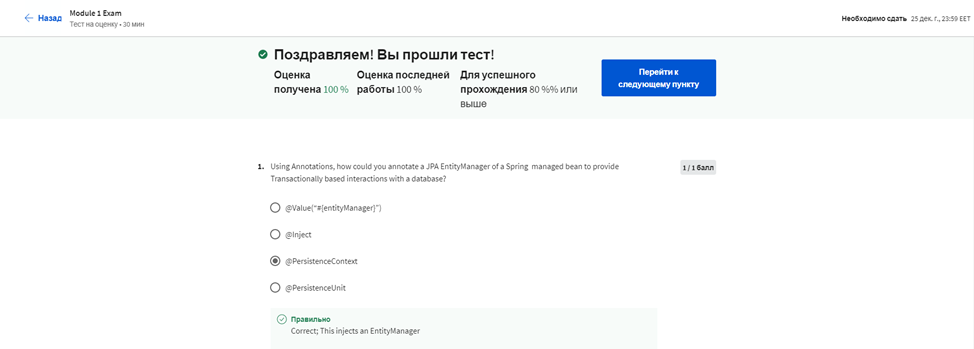
>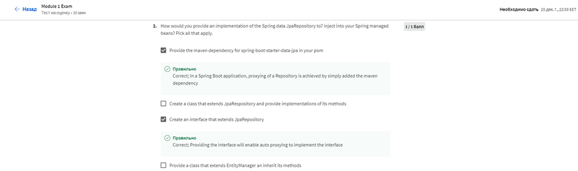
>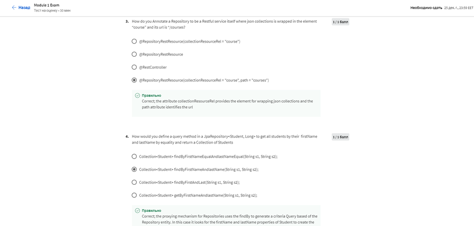
>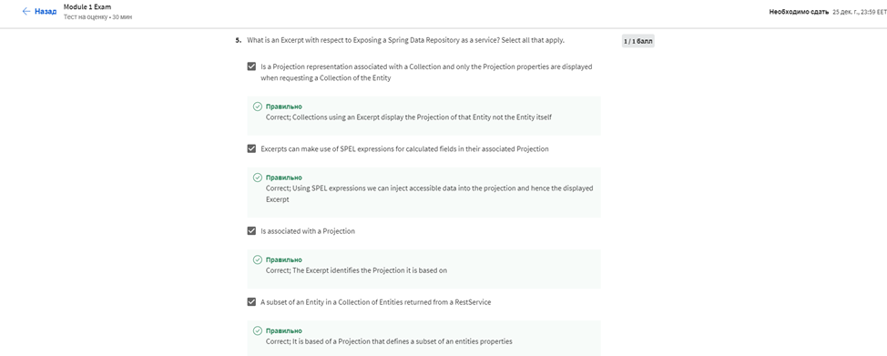
>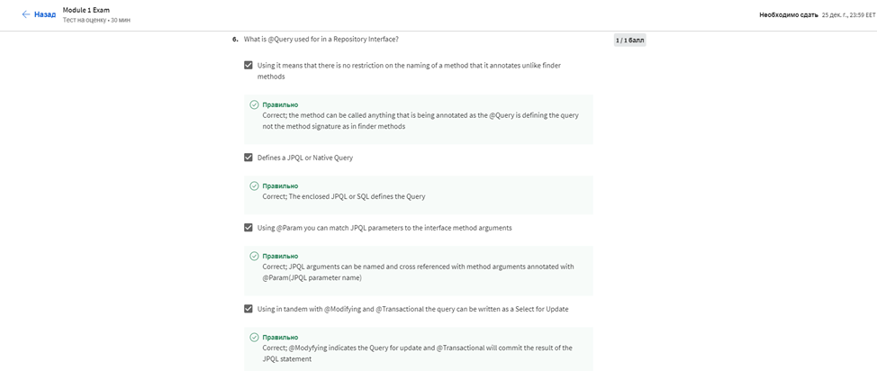
>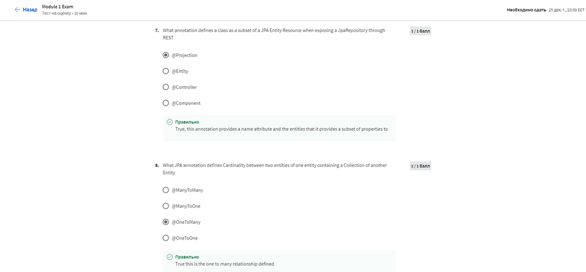
>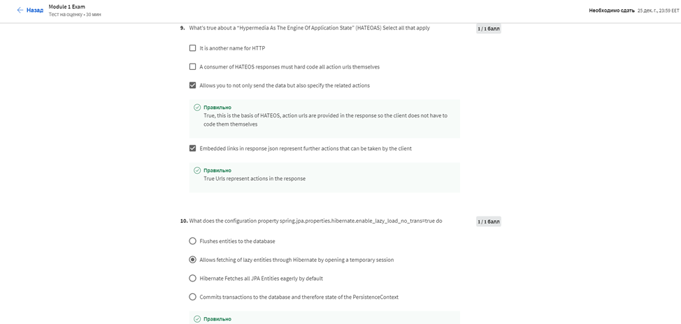

Результат:
>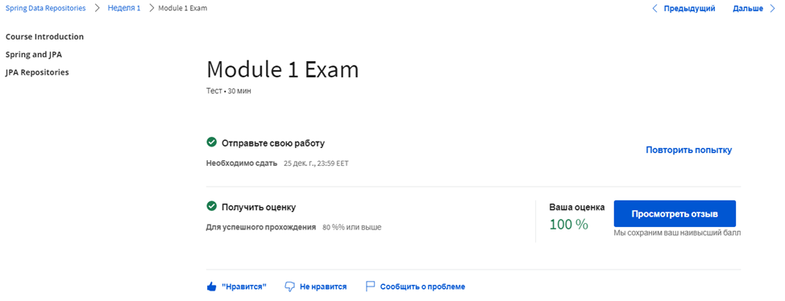

> Тиждень 2

Було виконанно Module 2 Quiz:
>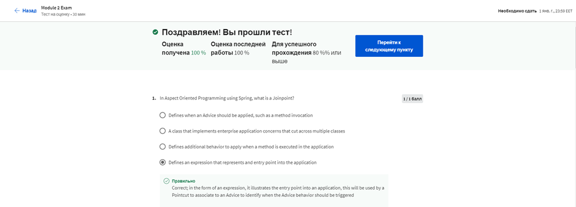
>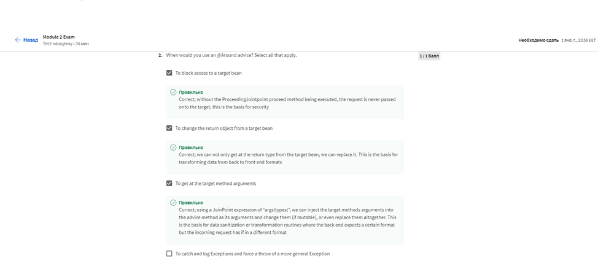
>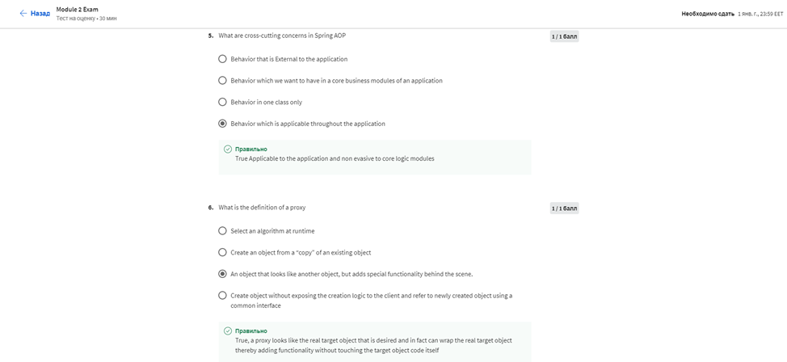
>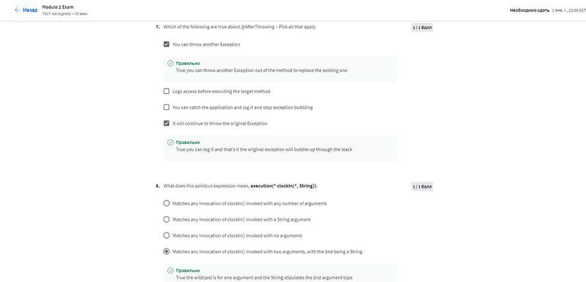
>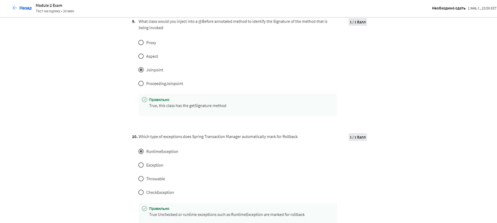

Результат:
>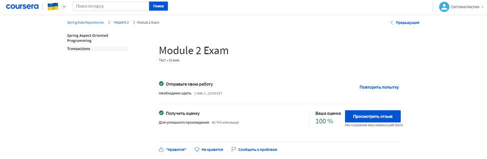

Сертефікат:
>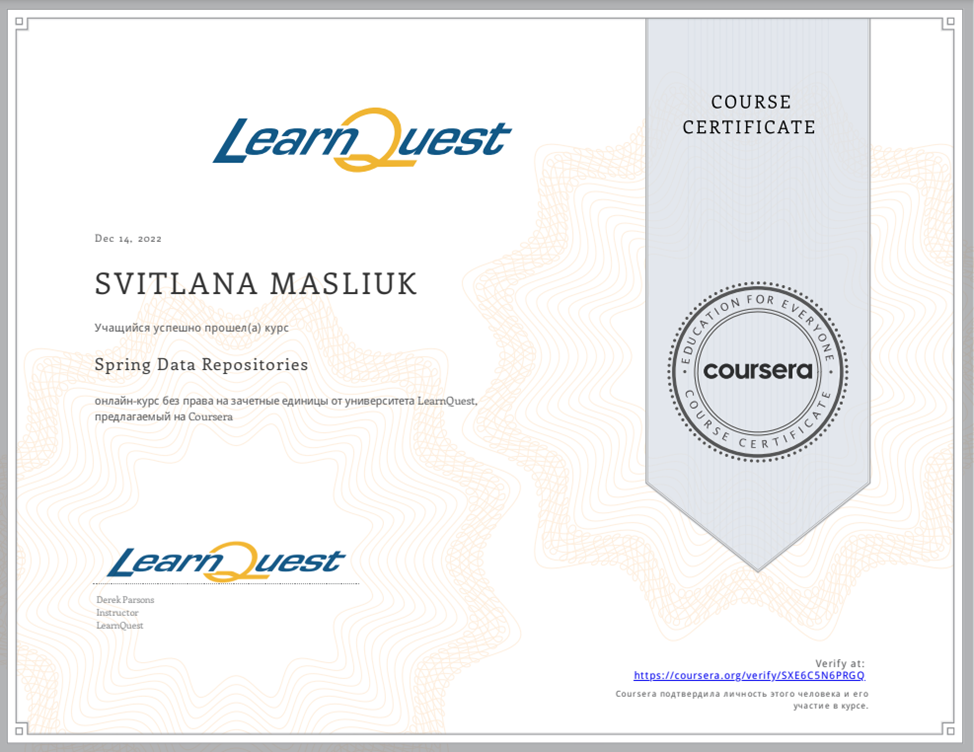
>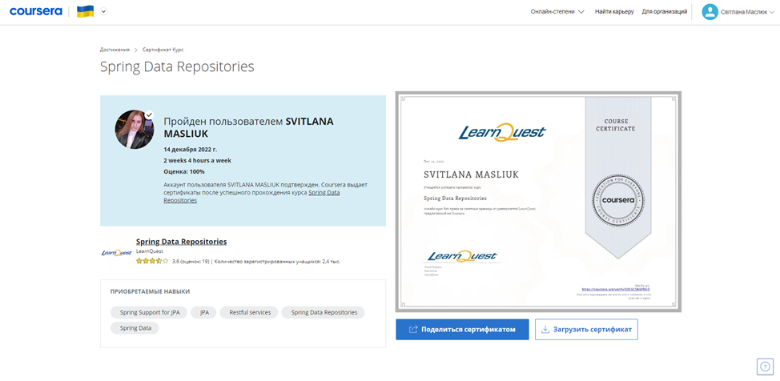
>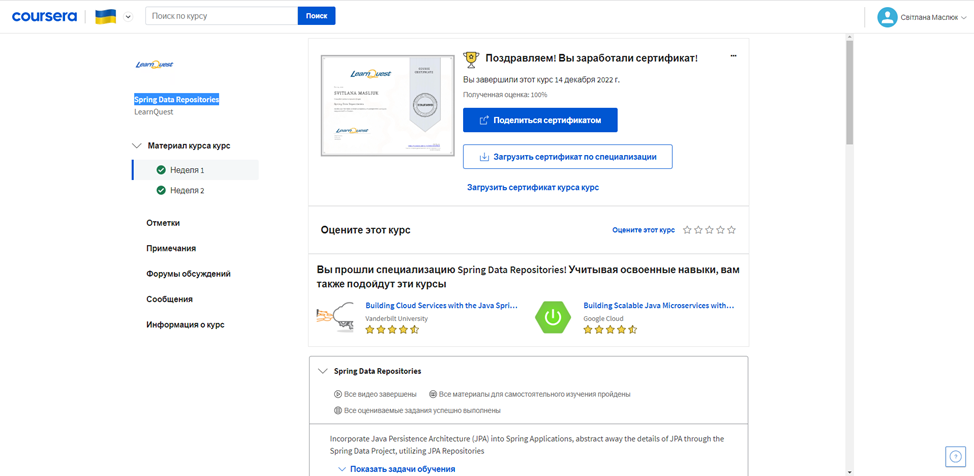
#### Висновок
На даному курсі ми дізнатися, чому Spring Framework є одним із домінуючих фреймворків розробки Java. 