# МІНІСТЕРСТВО ОСВІТИ І НАУКИ УКРАЇНИ

### ХАРКІВСКИЙ НАЦІОНАЛЬНИЙ ЕКОНОМІЧНИЙ УНІВЕРСИТЕТ ІМЕНИ СЕМЕНА КУЗНЕЦЯ

### КАФЕДРА ІНФОРМАЦІЙНИХ СИСТЕМ

#### ЗВІТ

з проходження курсу «Spring - Ecosystem and Core» 1-3 тиждень

з дисципліни «Сучасні Java-технології»

Виконав:
студент 4 курсу
групи  6.04.122.010.19.1
факультету ІТ
Маcлюк Світлана

Перевірив
доц. Поляков А.О.

Харків – 2022

#### Мета роботи
Дізнатися, чому Spring Framework є одним із домінуючих фреймворків розробки Java. Дослідити різноманітні техніки впровадження залежностей Java Object Dependency Injection з використанням різних форм даних конфігурації, наприклад XML, анотації та класи конфігурації Java із фабричними методами.

#### Репозиторій
[Посилання на репозиторій](https://github.com/MaslyukSveta/MJT/tree/master/SpringEcosystemandCore)

#### Хід роботи

#### Хід роботи
>На першому тижні ми дізнались, що є кілька механізмів для забезпечення перевірки необхідних залежностей. Більшість із них покладаються на здатність Spring дозволяти вам отримувати зворотні виклики в певних точках конструкції, ініціалізації об’єкта, як-от інтерфейс Spring InitializingBean або довільний метод ініціалізації Spring, який можна налаштувати в XML (за допомогою атрибута init-method ). Усе це дуже нагадує використання ін’єкції конструктора, з тією різницею, що ви покладаєтеся на Spring для виклику методу, у якому виконуються твердження.

Було виконанно Module 1 Quiz:
>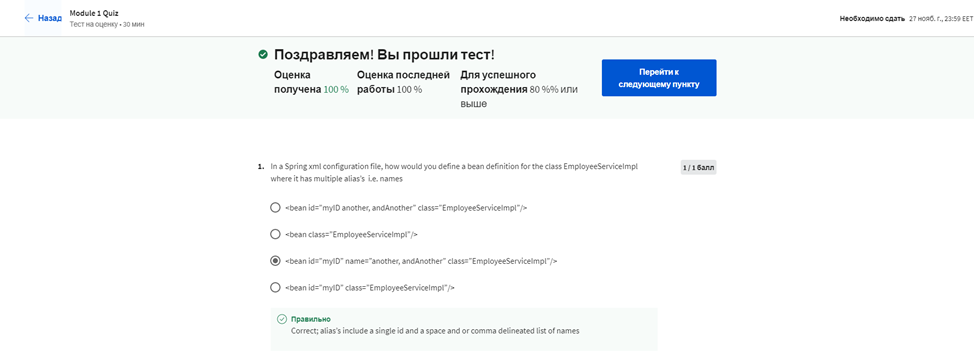
>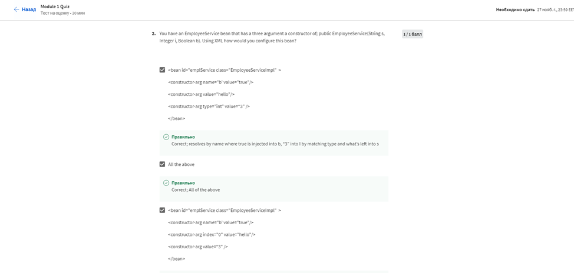
>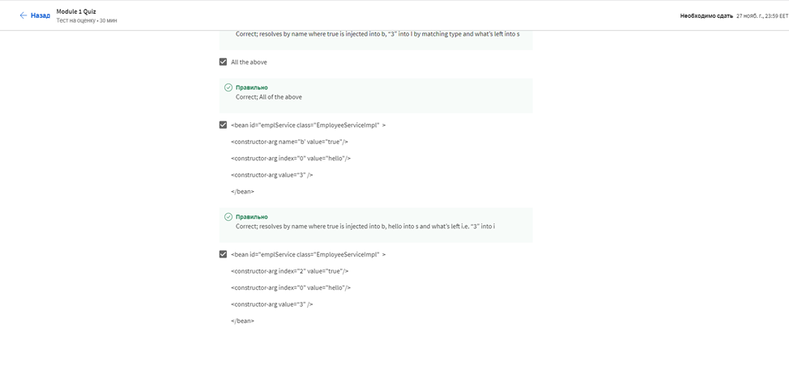
>
>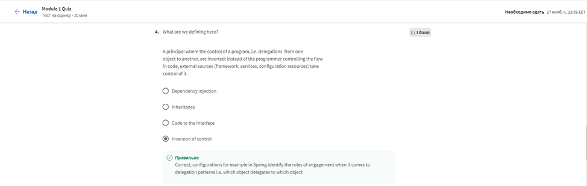
>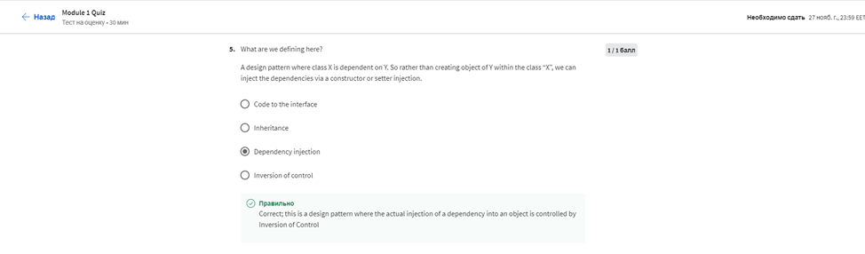
>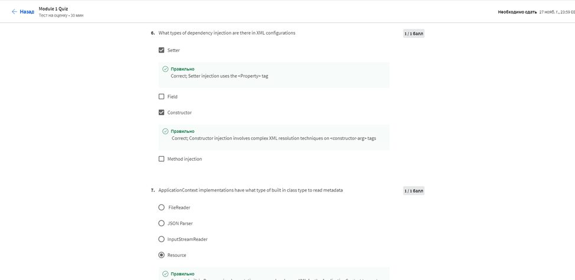
>

Результат:
>

>На другому тижні ми дізнались, як налаштувати впровадження залежностей у середовищі Spring за допомогою конфігурації на основі Java (конфігурація Java).
Дізнались, що Spring дозволяє вам робити ін’єкції залежностей за допомогою XML і анотацій, але вони мають деякі недоліки:
Впровадження залежностей через XML: хоча це робить налаштовані класи незалежними від Spring API, природа XML ускладнює навігацію через відносини залежностей між класами, коли код програми зростає та стає складнішим.
Введення залежностей за допомогою анотацій: це робить налаштовані класи тісно пов’язаними з Spring API – анотаціями @Component, @Service, @Autowired….
Таким чином, Spring забезпечує підхід конфігурації Java для ін’єкції залежностей, який може усунути недоліки XML і анотацій: налаштовані класи не забруднюються анотаціями Spring, і ними легко керувати. 

Було пройденно Ungraded Questions Annotations:

>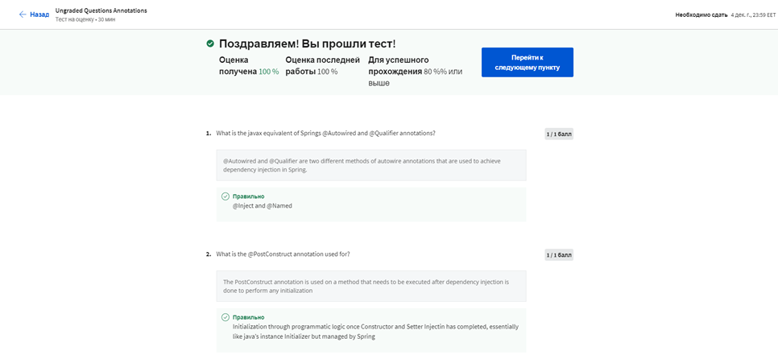
>

Результат:
>

Було виконанно Module 2 Quiz:
>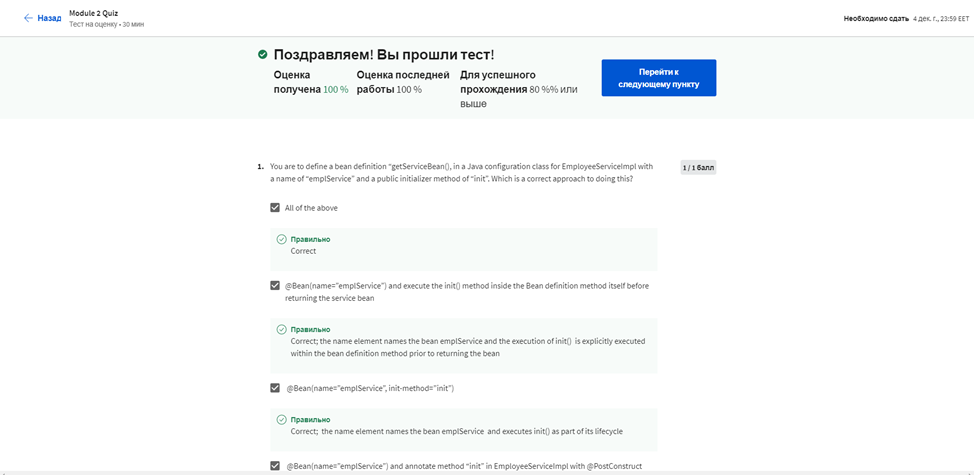
>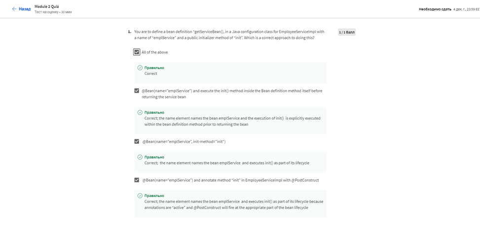
>
>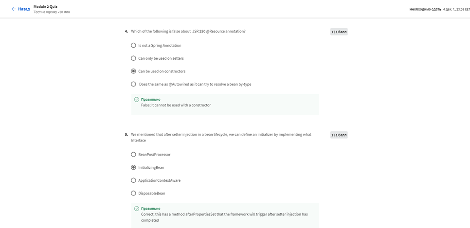
>
>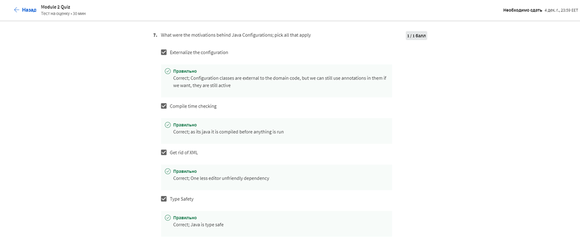
>
>

Результат:
>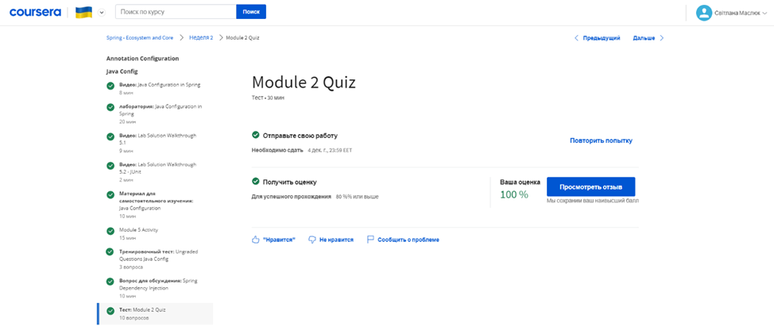
> На третьому тижні ми дізнались, що клас умови називається прямим класом (а не як spring bean), тому він не може використовувати ін’єкцію властивості @Value, тобто жодні інші spring bean-компоненти не можуть бути введені в нього.
З документів Java – Умови мають відповідати тим самим обмеженням, що й BeanFactoryPostProcessor, і ніколи не взаємодіяти з екземплярами bean. Обмеження, про які йдеться тут: BeanFactoryPostProcessor може взаємодіяти з визначеннями компонентів і змінювати їх, але ніколи не екземпляри компонентів. Це може призвести до передчасного створення екземпляра bean, порушення контейнера та спричинення небажаних побічних ефектів.

Було виконанно Module 3 Exam:
>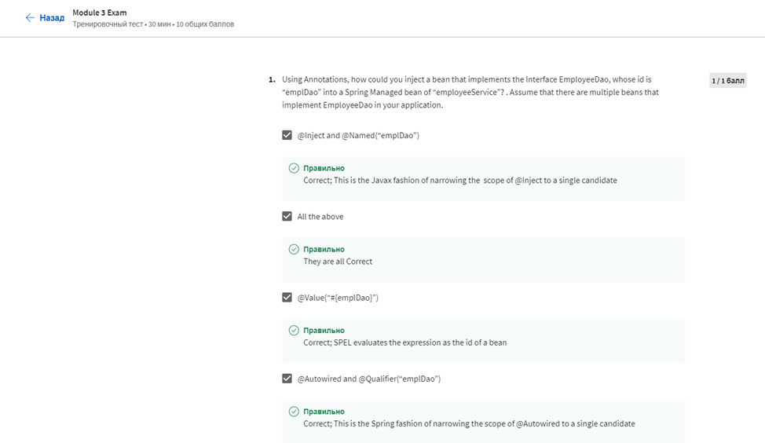
>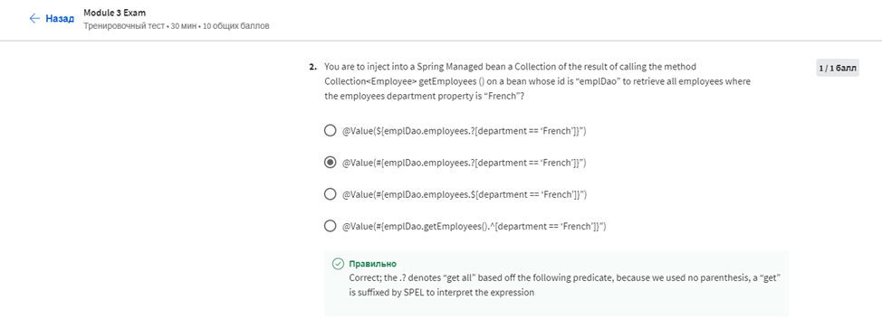
>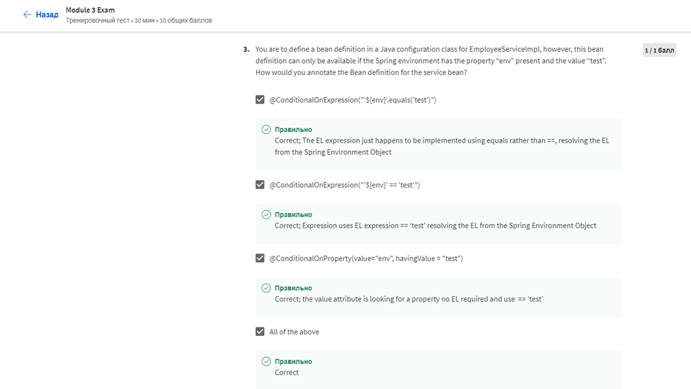
>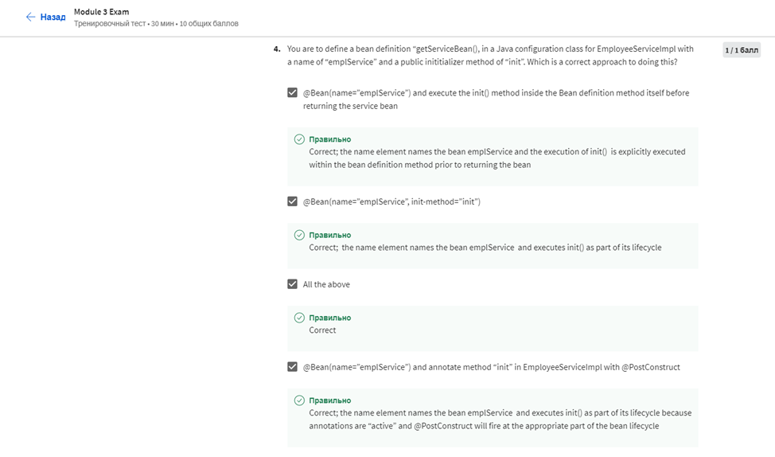
>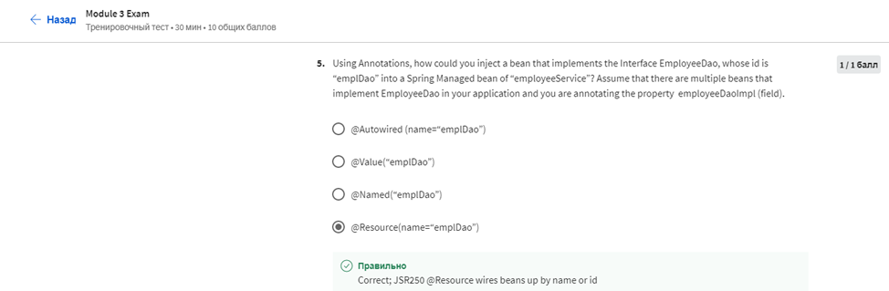
>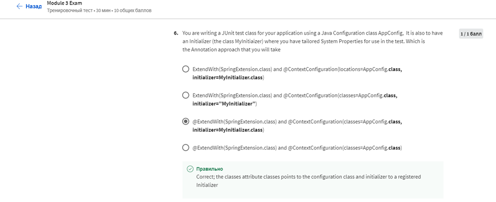
>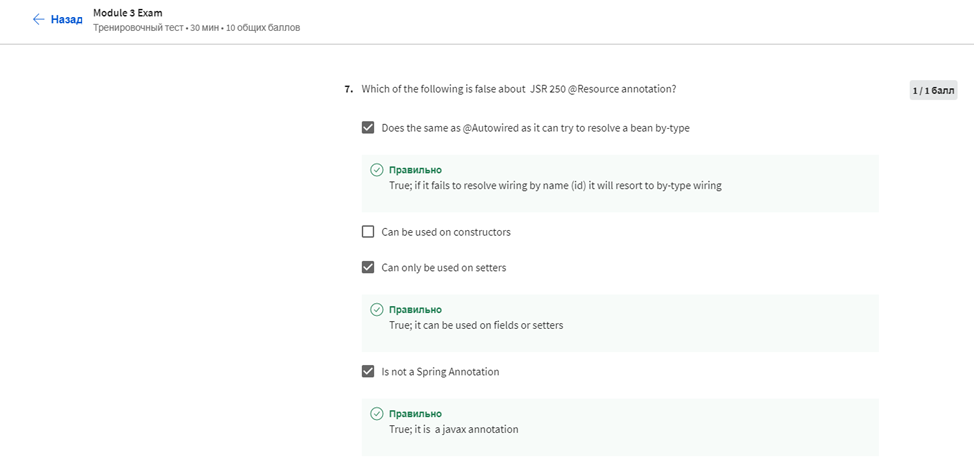
>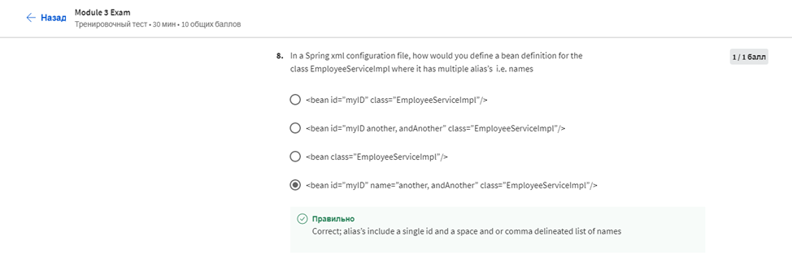
>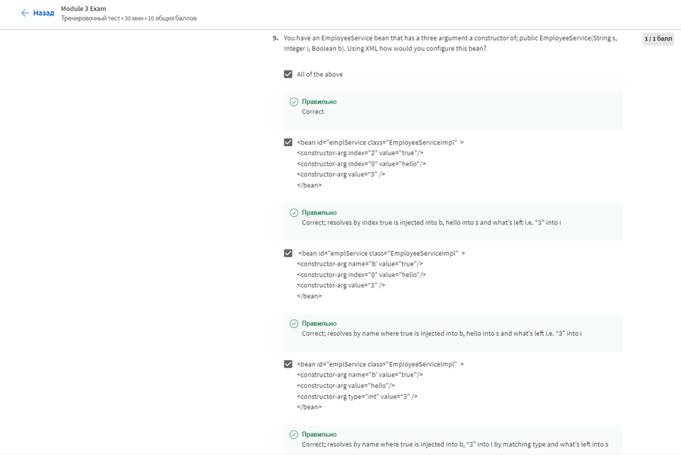
>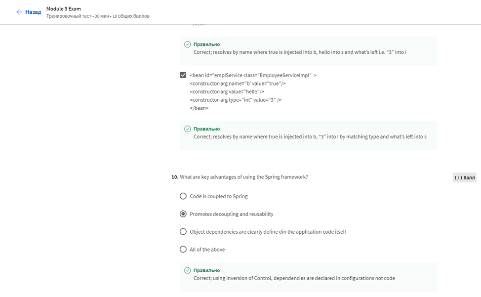
Результат:
>

Сертефікат:
>
>
#### Висновок
На даному курсі ми дізнатися, чому Spring Framework є одним із домінуючих фреймворків розробки Java. Дослідити різноманітні техніки впровадження залежностей Java Object Dependency Injection з використанням різних форм даних конфігурації таких як XML, анотації та класи конфігурації Java із фабричними методами.   